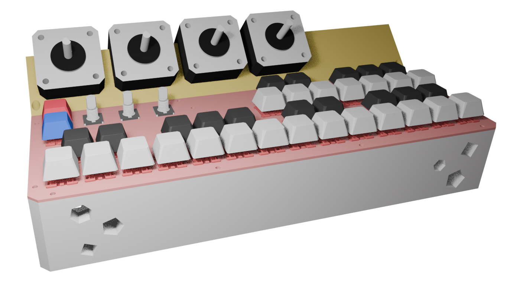
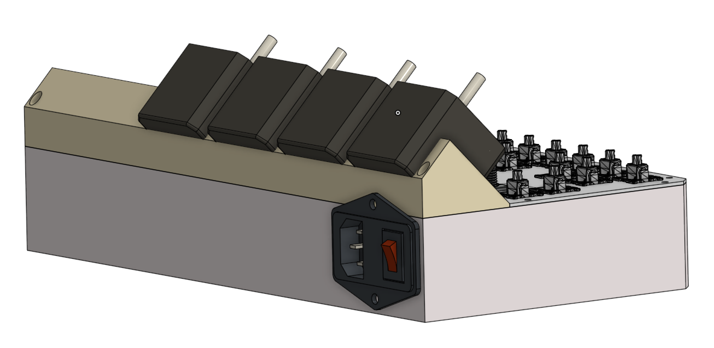
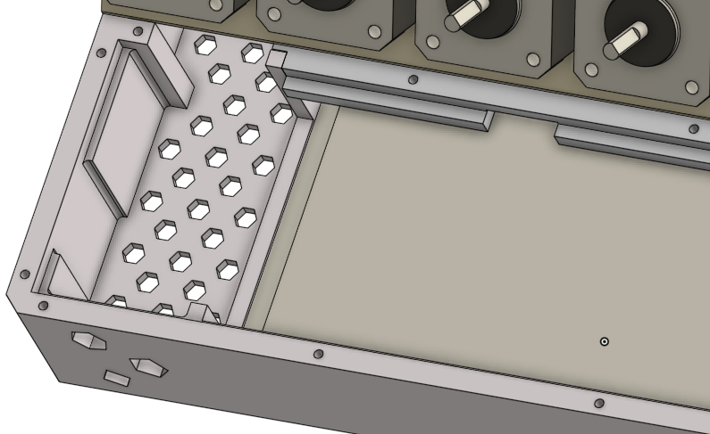
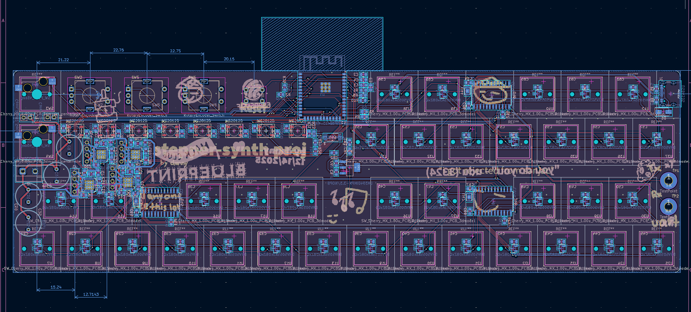
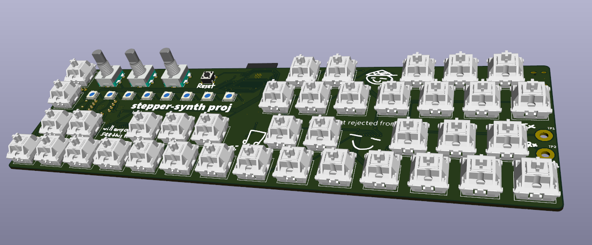
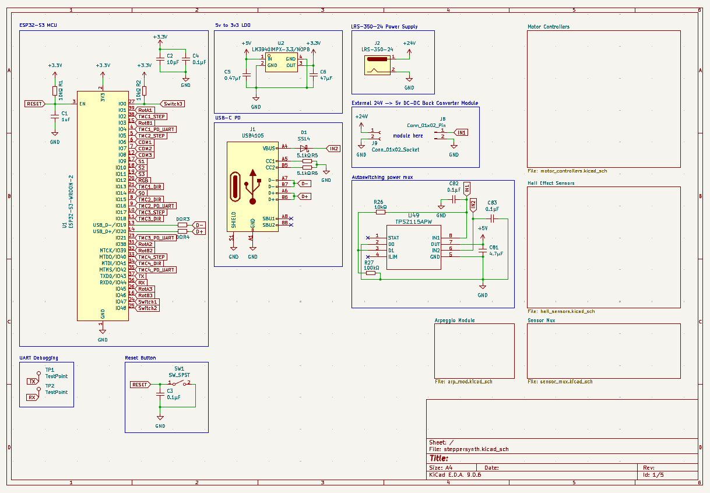
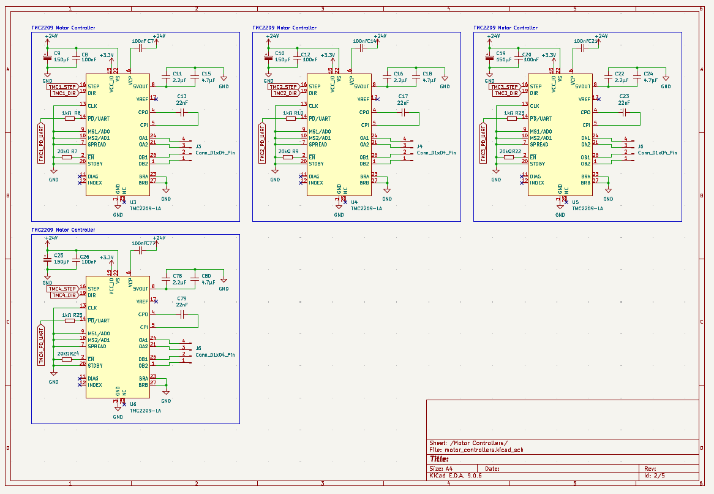
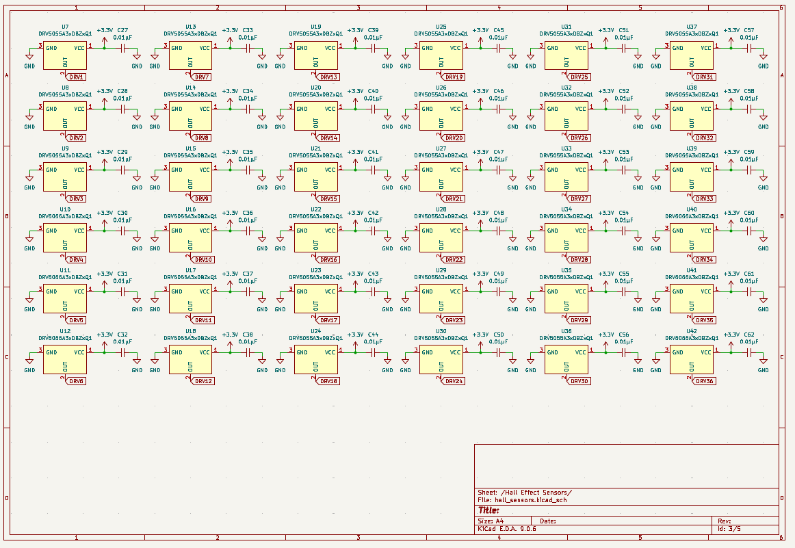
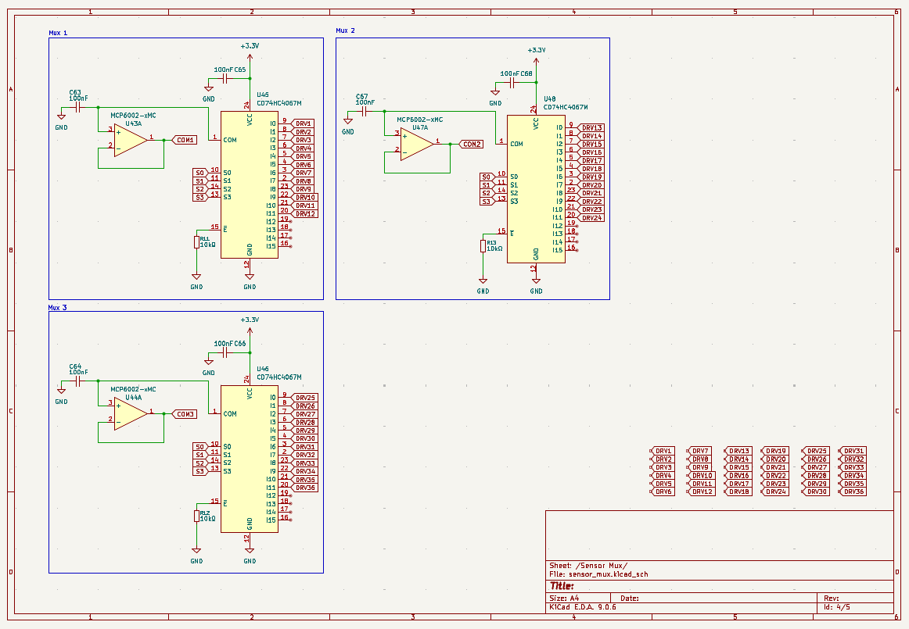
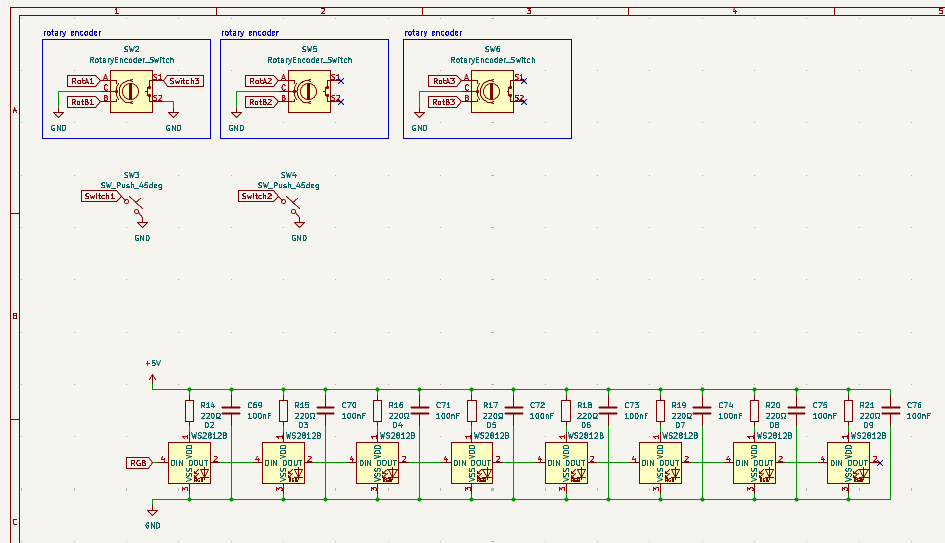

# stepper-synth

An electronic instrument that uses stepper motors to make music. Powered by the esp32 ecosystem, it is a synthesizer with 3 octaves with velocity support using hall effect sensors. It is inspired by the musician/engineer [Love Hultén](https://www.youtube.com/@hulten1000).

## Why I Made This

There's so many electronic instruments that make sounds purely through cables and rely on other devices to output to them. Instead, what if I used the power of stepper motors to make sound and create a standalone device? I notice how harmonic these motors could be while 3d printing, they sometimes have a noticable pattern and variable pitch that can be utilized.

## Photos

## PCB

## Schematics

## Bill of Materials

Sadly I was aiming for tier 2 budget but didn't realize how much tariffs and shipping would push me out of it 😭

Interactive Link: [google sheets](https://docs.google.com/spreadsheets/d/12KobohwvsCrDZkVZn1qAy473UDQfyoO-3Iqs66wPygc/edit?usp=sharing)

|Part                     |Cost   |Count|Count Cost|Note                                                     |Status |Link                                                                                                                                                             |
|-------------------------|-------|-----|----------|---------------------------------------------------------|-------|-----------------------------------------------------------------------------------------------------------------------------------------------------------------|
|Regular Switches         |       |2    |0         |                                                         |On hand|https://divinikey.com/collections/linear-switches                                                                                                                |
|Hall Effect Switches     |$13.50 |2    |$27.00    |18x per                                                  |       |https://divinikey.com/collections/hall-effect-switches/products/gateron-magnetic-genty-he-switches                                                               |
|Rotary Encoder           |       |3    |0         |                                                         |On hand|https://www.mouser.com/ProductDetail/Alps-Alpine/EC11E183440C?qs=YMSFtX0bdJC6PoDF7K4k%252Bg%3D%3D                                                                |
|Button                   |       |1    |0         |                                                         |On hand|https://www.digikey.com/en/products/detail/te-connectivity-alcoswitch-switches/1825910-6/1632536                                                                 |
|WS2812                   |$0.80  |8    |$6.40     |neopixels                                                |       |https://www.mouser.com/ProductDetail/SparkFun/COM-24837?qs=dbcCsuKDzFUNFvBH5VYBTw%3D%3D                                                                          |
|LRS-350-24               |       |1    |0         |power supply                                             |On hand|https://www.digikey.com/en/products/detail/mean-well-usa-inc/LRS-350-24/7705034                                                                                  |
|IEC320 C14 Switch        |       |1    |0         |cable input                                              |On hand|https://www.aliexpress.us/item/3256804155743663.html                                                                                                             |
|Screw Terminal           |$0.35  |1    |$0.35     |                                                         |       |https://www.mouser.com/ProductDetail/Same-Sky/TB002-500-02BE?qs=vLWxofP3U2x9716kcgva%2Fw%3D%3D                                                                   |
|Nema 17 0.8 Motors       |       |4    |$0.00     |reused prusas                                            |On hand|https://www.omc-stepperonline.com/nema-17-bipolar-0-9deg-46ncm-65-1oz-in-2a-2-9v-42x42x48mm-4-wires-17hm19-2004s                                                 |
|ESP32-S3-WROOM-2         |$11.87 |1    |$11.87    |microcontroller                                          |       |https://www.mouser.com/ProductDetail/Espressif-Systems/ESP32-S3-WROOM-2-N32R16V?qs=%252BHhoWzUJg4Kf%2FwmS40wg%252BQ%3D%3D                                        |
|Solder Paste Syringe     |$16.95 |1    |$16.95    |mine dried out                                           |       |https://www.mouser.com/ProductDetail/Chip-Quik/TS391LT?qs=1mbolxNpo8dzjCIcP7S2Kg%3D%3D                                                                           |
|150uF Polarized Capacitor|$1.40  |4    |$5.60     |                                                         |       |https://www.mouser.com/ProductDetail/Panasonic/EEH-AZA1E151B?qs=sGAEpiMZZMsh%252B1woXyUXj7hTFrnMyX90Ysfyv/7vmlA%3D                                               |
|Female Pin Headers       |$0.84  |2    |$1.68     |                                                         |       |https://www.mouser.com/ProductDetail/Samtec/CES-102-02-G-S?qs=0lQeLiL1qyY%2FrwXtinpohw%3D%3D                                                                     |
|Hot-swap Switch Plug     |       |2    |0         |                                                         |On hand|https://www.gateron.com/products/gateron-low-profile-switch-hot-swap-pcb-socket?srsltid=AfmBOop0aFTt__A_sBY2D5LC6GJteiDSPO9H3qEt2M2Dhil_s2AUwsRR&VariantsId=10234|
|M3x5mm Screws            |       |18   |          |                                                         |On hand|https://www.moddiy.com/products/1264/M3.0-x-5mm-Black-Screws-(KM3X5).html?srsltid=AfmBOorXbTDS16CG3UQ8tCHJn64vKhPv2bQRUskhtAbTRuyfojuJ6yEs_D8                    |
|                         |       |     |          |                                                         |       |                                                                                                                                                                 |
|PCB Prototype            |$12.20 |     |          |                                                         |       |                                                                                                                                                                 |
|PCBA                     |$90.68 |     |          |6 extended parts only                                    |       |                                                                                                                                                                 |
|Merchandise Total        |$102.88|     |          |pcb + pcba                                               |       |                                                                                                                                                                 |
|Shipping Estimate        |$55.24 |     |          |                                                         |       |                                                                                                                                                                 |
|Duties & Taxes (US)      |$46.30 |     |          |                                                         |       |                                                                                                                                                                 |
|Sales Tax                |$13.04 |     |          |                                                         |       |                                                                                                                                                                 |
|Grand Total              |$217.46|     |          |only count this                                          |       |                                                                                                                                                                 |
|                         |       |     |          |                                                         |       |                                                                                                                                                                 |
|                         |$217.46|     |69.85     |                                                         |       |                                                                                                                                                                 |
|                         |       |     |          |                                                         |       |                                                                                                                                                                 |
|Needed for Grant         |$287.31|     |          |not including shipping and taxes from mouser/divinikey!!!|       |                                                                                                                                                                 |
|                         |       |     |          |though mouser shipping should be really low              |       |                                                                                                                                                                 |
